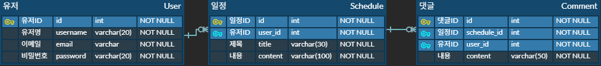

# Scheduler

Spring Boot 기반의 일정 관리 애플리케이션입니다.  
일정(Schedule), 댓글(Comment), 사용자(User) 기능을 포함하며 Session 기반 인증과 예외 처리 기능을 제공합니다.  
이 프로젝트는 일정 관리를 효율적으로 하기 위해 제작되었습니다.

## 주요 기능

### 1. 사용자(User)
- 회원가입, 로그인, 사용자 정보 수정, 회원 탈퇴
- 비밀번호 암호화 저장
- Session 기반 인증

### 2. 일정(Schedule)
- 일정 생성, 조회, 수정, 삭제
- 작성자 정보 포함

### 3. 댓글(Comment)
- 일정별 댓글 작성, 조회, 수정, 삭제
- 작성자 정보 포함

## 프로젝트 구조
src/main/java/com/example/scheduler  
├── auth # 로그인, 로그아웃, 인증 관련 기능  
├── comment # 댓글 관련 기능  
├── schedule # 일정 관련 기능  
├── user # 사용자 관련 기능  
├── global # 전역 설정, 예외 처리  
└── SchedulerApplication.java 

## API 명세서

[API 문서 보기](https://www.notion.so/248ad6b19b1a80e5ae78e88e7ef1906b?v=248ad6b19b1a81ae9fd9000c15c9e657&source=copy_link)

## ERD

